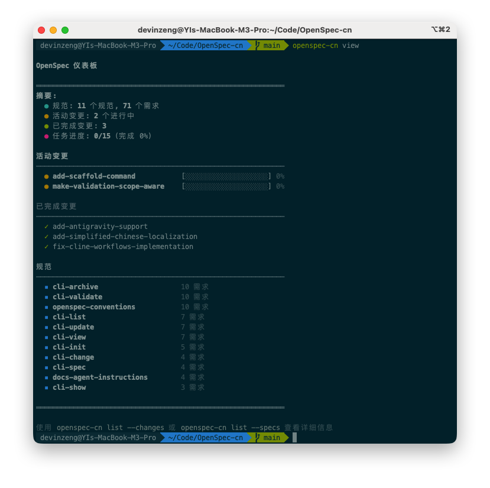

<p align="center">
  <a href="https://github.com/studyzy/openspec-cn">
    <picture>
      <source srcset="assets/openspec_bg.png">
      
    </picture>
  </a>
</p>

<p align="center">
  <a href="./LICENSE"></a>
</p>

> [!NOTE]
> 本仓库当前按个人本地使用场景维护，默认通过源码本地安装，不再包含自动发布流程。


<details>
<summary><strong>最受喜爱的规范（spec）框架。</strong></summary>

[](https://github.com/studyzy/openspec-cn/stargazers)
[](https://github.com/studyzy/openspec-cn/graphs/contributors)

</details>
<p></p>
我们的理念：

```text
→ 灵活，而非僵化
→ 迭代，而非瀑布式
→ 简单，而非复杂
→ 面向存量项目（brownfield），而不只是新项目（greenfield）
→ 从个人项目到企业规模都可扩展
```

> [!TIP]
> **全新工作流现已上线！** 我们用一种全新的“以制品（artifact）为导向”的工作流重构了 OpenSpec。
>
> 直接让 AI 使用 `opsx-plan` 或 `opsx-explore` 开始。→ [在工作流文档中了解更多](docs/workflows.md)

<!-- TODO: 添加 opsx-plan → opsx-archive 工作流的 GIF 演示 -->

## 看看效果

```text
你：请使用 `opsx-plan` 为 dark mode 创建一个新变更
AI：创建 openspec/changes/2026-04-10-add-dark-mode/
    已生成 proposal / specs / design
    下一步进入 plan-review

你：请继续使用 `opsx-tasks`
AI：✓ tasks.md     — 实现清单
    ✓ task-analyze — 已通过
    准备进入实现

你：请使用 `opsx-implement`
AI：开始按 tasks.md 实施...
    ✓ 1.1 添加主题上下文 Provider
    ✓ 1.2 创建切换组件
    ✓ 2.1 添加 CSS 变量
    ✓ 2.2 接入 localStorage
    所有任务已完成！

你：请使用 `opsx-verify`
你：请使用 `opsx-review`
你：请使用 `opsx-archive`
AI：已归档至 openspec/changes/archive/2025-01-23-add-dark-mode/
    Specs 已更新。可以开始下一个功能了。
```

<details>
<summary><strong>OpenSpec 仪表盘</strong></summary>

<p align="center">
  
</p>

</details>

## 快速开始

将 skill 同步到你的项目：

```bash
./scripts/sync.sh /path/to/your-project
```

现在告诉你的 AI：`请使用 opsx-plan 为 <你想要构建的功能> 创建变更`

> [!NOTE]
> 不确定你的工具是否受支持？[查看完整列表](docs/supported-tools.md) – 我们支持 20+ 工具，并仍在持续增长。

## 文档

→ **[快速入门](docs/getting-started.md)**：开始使用<br>
→ **[工作流](docs/workflows.md)**：组合与模式<br>
→ **[支持的工具](docs/supported-tools.md)**：工具集成与安装路径<br>
→ **[概念](docs/concepts.md)**：整体如何运转<br>


## 为什么选择 OpenSpec？

AI 编程助手很强大，但当需求只存在于聊天记录里时，结果往往难以预测。OpenSpec 增加了一层轻量的规范（spec）机制，让你在写任何代码前先对齐要做什么。

- **先对齐，再开工** —— 人类与 AI 在写代码前先在规范上达成一致
- **保持有序** —— 每个变更都有自己的目录：proposal、specs、design、tasks
- **流式协作** —— 任意制品都可以随时更新，不设僵硬的阶段门槛
- **用你现有的工具** —— 通过项目内 skills 驱动你的 AI 助手

### 我们如何对比

**对比 [Spec Kit](https://github.com/github/spec-kit)**（GitHub）—— 很全面但偏厚重：阶段门槛严格、Markdown 很多、需要 Python 环境。OpenSpec 更轻量，也更适合自由迭代。

**对比 [Kiro](https://kiro.dev)**（AWS）—— 功能强大，但会被锁定在他们的 IDE 中，并且模型选择受限（主要是 Claude）。OpenSpec 可与您已有的工具协作。

**对比“什么都不用”** —— 只靠聊天做 AI 编程容易产生模糊需求和不可预测的实现。OpenSpec 在不增加太多仪式感的前提下，带来更可预期的结果。

## 更新 OpenSpec

**重新同步 skill 到目标项目**

```bash
./scripts/sync.sh /path/to/your-project
```

批量同步多个仓库：

```bash
./scripts/sync-all.sh
```

## 使用注意事项

**模型选择**：OpenSpec 更适合高推理模型。我们推荐在规划与实现阶段都使用 Opus 4.5 和 GPT 5.2。

**上下文卫生**：OpenSpec 受益于更干净的上下文窗口。在开始实现前清理上下文，并在整个会话中保持良好的上下文卫生。

## 参与贡献

**小修小补** —— Bug 修复、错别字修正与小型改进可以直接提交 PR。

**使用反馈** —— 可通过 [GitHub Issue](https://github.com/studyzy/openspec-cn/issues) 提交反馈。

**较大改动** —— 对于新功能、重大重构或架构调整，请先提交一个 OpenSpec 变更提案，以便在实现前对齐意图与目标。

撰写提案时，请牢记 OpenSpec 的理念：我们服务于各种不同的编码代理、模型与使用场景。改动应对所有人都工作良好。

**欢迎 AI 生成代码** —— 只要经过测试与验证即可。包含 AI 生成代码的 PR 应注明使用的编码代理与模型（例如："Generated with Claude Code using claude-opus-4-5-20251101"）。

### Claude Code 工具

`scripts/claude-code/` 目录包含配合 Claude Code 使用的辅助脚本，需要 [Bun](https://bun.sh) 运行时。

**statusline.ts** — Claude Code 状态行脚本

在 Claude Code 底部显示实时状态信息：git 分支、活跃变更名（📋）、上下文使用率、token 明细（`↑in ↓out cr:cacheRead cw:cacheWrite ⚡hitRate%`）、模型名、费用等。

安装：复制到 `~/.claude/statusline.ts`，然后在 `~/.claude/settings.json` 中配置：

```json
{
  "statusLine": {
    "type": "command",
    "command": "/bin/sh -c 'PATH=\"$HOME/.bun/bin:$PATH\" bun \"$HOME/.claude/statusline.ts\"'"
  }
}
```

**token-tracker.ts** — OpenSpec 变更 token 消耗追踪

解析 Claude Code 的 transcript JSONL 文件，将 token 消耗按 session 归属到指定的 OpenSpec 变更，以 append-only 方式写入 `token-usage.jsonl` 时间轴明细。

```bash
# 安装
cp scripts/claude-code/token-tracker.ts ~/.claude/token-tracker.ts

# 使用：将当前会话的 token 记录到指定变更
bun ~/.claude/token-tracker.ts <transcript-path> <change-dir>

# 示例
bun ~/.claude/token-tracker.ts \
  ~/.claude/projects/-Users-me-myproject/abc123.jsonl \
  openspec/changes/2026-04-10-my-feature
```

输出格式（每行一个 JSON 对象）：
```json
{"ts":"2026-04-10T08:44:04.857Z","sid":"abc123","model":"claude-opus-4-6","in":3,"out":510,"cr":0,"cw":33800}
```

支持重复执行（幂等），不会产生重复记录。

### 开发

- 同步 skill：`scripts/sync.sh <target-dir>`
- 批量同步：`scripts/sync-all.sh`（需在脚本中配置目标仓库路径）
- 约定式提交（单行）：`type(scope): subject`

## 其他

<details>
<summary><strong>遥测（Telemetry）</strong></summary>

OpenSpec 会收集匿名使用统计。

我们只收集命令名与版本号，用于理解使用模式；不会收集参数、路径、内容或任何个人信息。CI 中会自动禁用。

**退出（Opt-out）：** `export OPENSPEC_TELEMETRY=0` 或 `export DO_NOT_TRACK=1`

</details>

<details>
<summary><strong>维护者与顾问</strong></summary>

核心维护者与顾问列表见 [MAINTAINERS.md](MAINTAINERS.md)。

</details>


## 许可证

MIT
